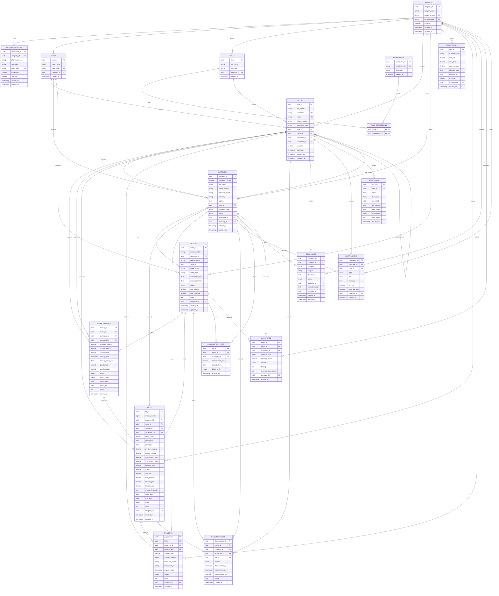

# مخطط علاقات قاعدة البيانات (Entity Relationship Diagram - ERD)

هذا المستند يحتوي على مخطط العلاقات (ERD) لقاعدة البيانات الخاصة بنظام إدارة الكهرباء الذكي (SEMS)، متضمناً جدول الشركات وإجراءات تعدد الشركات (Multi-Tenancy) التي تمت إضافتها مؤخراً في المرحلة الثامنة.

## 1. مخطط Mermaid البصري (Visual ERD)

---

## 2. تفاصيل عزل البيانات متعددة الشركات (Multi-Tenancy Details)

يتم تحقيق عزل البيانات من خلال ربط معظم الجداول بجدول `COMPANIES` عبر المفتاح الخارجي `company_id`.

* **تخصيص الصلاحيات والأدوار:** لكل شركة أدوارها وصلاحياتها الخاصة بها لمنع التداخل.
* **الأمان والعزل الفعلي (Logical Separation):** يتم تصفية جميع الاستعلامات البرمجية من خلال وسيط `tenantContext` الذي يستخرج `company_id` ويقوم بإضافته تلقائياً كشرط رئيسي (`WHERE company_id = ...`) في كل الاستعلامات الخاصة بقراءة أو تعديل البيانات.
