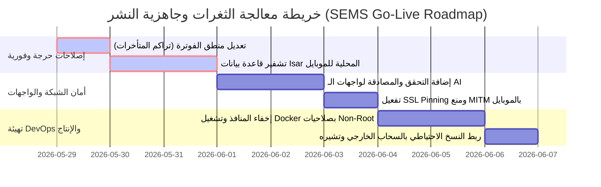

# لوحة معلومات التدقيق الأمني والجاهزية الرئيسية (Master Audit Dashboard)
**المشروع:** نظام إدارة الكهرباء الذكي (SEMS)  
**فريق التدقيق:** Senior Enterprise Auditors & DevSecOps Specialists  
**الحالة العامة للمشروع:** %68 جاهزية (يحتاج إصلاحات حرجة قبل الإطلاق)  

---

## 1. دليل الوثائق والتقارير الـ 13 (Audit Deliverables Index)

لقد قمنا بإعداد وتوزيع مخرجات التدقيق الفني والأمني والجاهزية على 13 وثيقة متخصصة يمكن الوصول إليها مباشرة في مشروعك كالتالي:

| الوثيقة | الوصف الفني | الرابط المباشر |
| :--- | :--- | :--- |
| **1. تقرير الأمان الشامل** | تحليل الثغرات وفق تصنيف OWASP Top 10 للويب والموبايل. | [1_security_audit_report.md](file:///c:/Users/Roots/Desktop/Smart%20Electricity%20Management%20System/docs/1_security_audit_report.md) |
| **2. تقييم نقاط الضعف** | حصر وتفصيل الثغرات المكتشفة مع طريقة المعالجة والحل البرمجي. | [2_vulnerability_assessment.md](file:///c:/Users/Roots/Desktop/Smart%20Electricity%20Management%20System/docs/2_vulnerability_assessment.md) |
| **3. توصيات اختبار الاختراق** | سيناريوهات اختبار الاختراق العملي لواجهات البرمجة والموبايل والذكاء الاصطناعي. | [3_penetration_testing_recommendations.md](file:///c:/Users/Roots/Desktop/Smart%20Electricity%20Management%20System/docs/3_penetration_testing_recommendations.md) |
| **4. تقرير تحسين الأداء** | فهارس قاعدة البيانات، تخزين Redis المؤقت، ضغط الصور وتحسين الاتصالات. | [4_performance_optimization_report.md](file:///c:/Users/Roots/Desktop/Smart%20Electricity%20Management%20System/docs/4_performance_optimization_report.md) |
| **5. مراجعة المعمارية** | الامتثال لبنية Clean Architecture، مبادئ SOLID، والديون التقنية للبرمجة. | [5_architecture_improvements.md](file:///c:/Users/Roots/Desktop/Smart%20Electricity%20Management%20System/docs/5_architecture_improvements.md) |
| **6. تحصين DevOps** | أمان حاويات Docker، جاهزية Kubernetes، التكامل المستمر وأسرار GitHub. | [6_devops_hardening.md](file:///c:/Users/Roots/Desktop/Smart%20Electricity%20Management%20System/docs/6_devops_hardening.md) |
| **7. تحسين قاعدة البيانات** | تشفير pgcrypto، أمان اتصالات SSL، وسياسة النسخ الاحتياطي التراكمية. | [7_database_optimization.md](file:///c:/Users/Roots/Desktop/Smart%20Electricity%20Management%20System/docs/7_database_optimization.md) |
| **8. أمان تطبيق الهاتف** | تشفير قاعدة بيانات Isar المحلية، حماية الهندسة العكسية وتفعيل SSL Pinning. | [8_mobile_app_security.md](file:///c:/Users/Roots/Desktop/Smart%20Electricity%20Management%20System/docs/8_mobile_app_security.md) |
| **9. أمان واجهات الـ API** | سرية مفاتيح JWT، حماية الأدوار (RBAC)، وثغرة عزل نطاق الفنيين الجغرافي. | [9_api_security.md](file:///c:/Users/Roots/Desktop/Smart%20Electricity%20Management%20System/docs/9_api_security.md) |
| **10. أمان الذكاء الاصطناعي** | إلغاء مخرجات OCR الافتراضية والتحقق من الاستثناءات، وحماية الشات بوت. | [10_ai_security.md](file:///c:/Users/Roots/Desktop/Smart%20Electricity%20Management%20System/docs/10_ai_security.md) |
| **11. نقاط جاهزية الإنتاج** | النتيجة الكمية الكلية الموزعة على 5 ركائز أساسية لجودة البرمجيات. | [11_production_readiness_score.md](file:///c:/Users/Roots/Desktop/Smart%20Electricity%20Management%20System/docs/11_production_readiness_score.md) |
| **12. تقييم المخاطر المؤسسية** | خطة استمرارية الأعمال (BCP)، سيناريوهات تعطل قواعد البيانات وحجب الخدمة. | [12_enterprise_risk_assessment.md](file:///c:/Users/Roots/Desktop/Smart%20Electricity%20Management%20System/docs/12_enterprise_risk_assessment.md) |
| **13. قائمة المراجعة النهائية** | الخطوات العملية والإجراءات التأسيسية قبل الضغط على زر Go-Live ونشر النظام. | [13_production_deployment_checklist.md](file:///c:/Users/Roots/Desktop/Smart%20Electricity%20Management%20System/docs/13_production_deployment_checklist.md) |

---

## 2. لوحة تقييم المخاطر وتوزيع الجاهزية (Risk & Readiness Dashboard)

---

## 3. رسالة أخيرة من فريق التدقيق (A Note from the Lead Auditor)
إن نظام إدارة الكهرباء الذكي (SEMS) يمتلك بنية هيكلية قوية، والجداول مصممة بكفاءة عالية لتلبية احتياجات الفوترة الحقيقية لشركات الطاقة. مع ذلك، فإن الانتقال للنشر الإنتاجي يتطلب اتخاذ خطوات حاسمة لتصحيح خطأ حساب الفواتير المتكرر وتفعيل التشفير في تطبيق الموبايل وقاعدة البيانات.

تطبيق التوصيات الواردة في هذه التقارير سيضمن الحصول على نظام آمن بالكامل ومستقر وقابل للتوسع لخدمة عشرات الآلاف من المشتركين بثقة وموثوقية عالية.
